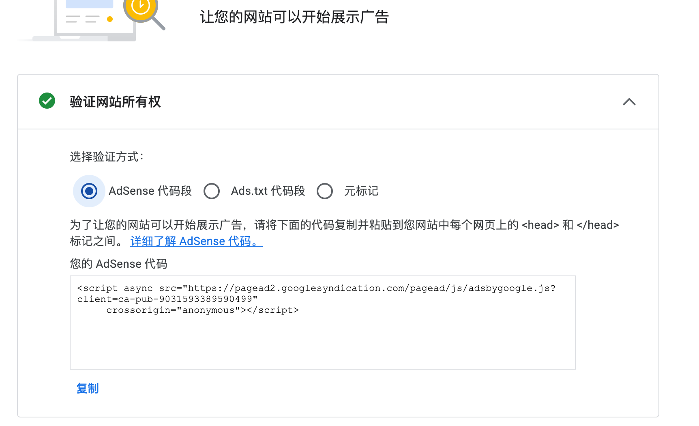
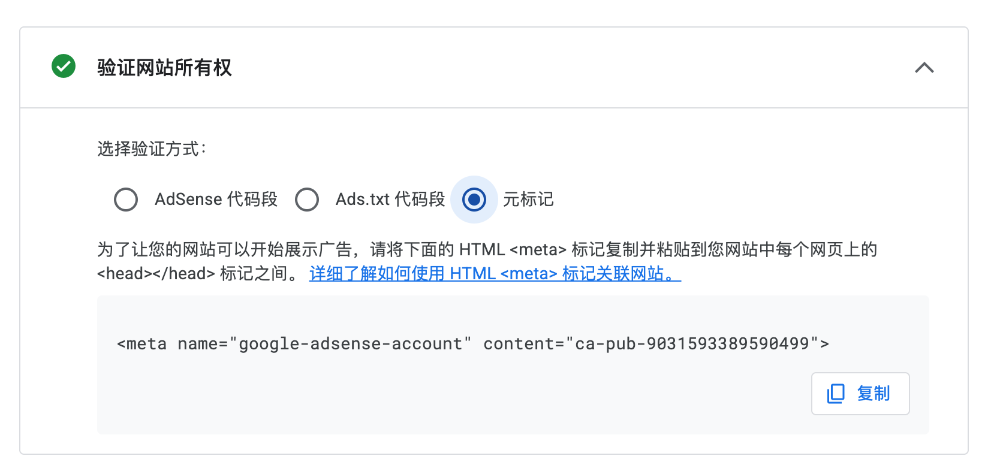
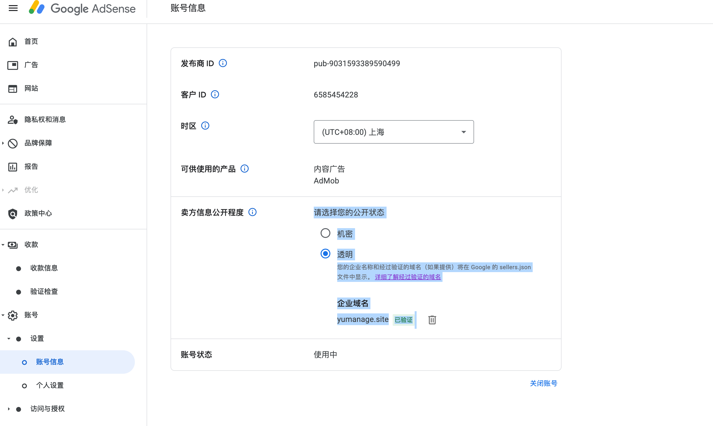
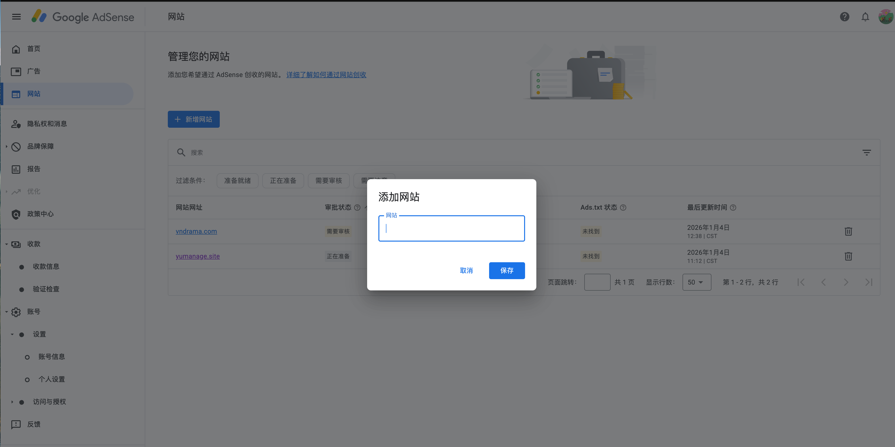

# Google AdSense 申请流程

整理了一下申请 AdSense 的完整流程，踩过一些坑，记录下来备忘。

## 目录

1. [申请前准备](#1-申请前准备)
2. [注册账户](#2-注册账户)
3. [连接网站](#3-连接网站)
4. [等待审核](#4-等待审核)
5. [通过后的设置](#5-通过后的设置)
6. [一些坑和注意事项](#6-一些坑和注意事项)
7. [ads.txt 配置](#7-adstxt-配置)
8. [sellers.json 设置](#8-sellersjson-设置)
9. [参考链接](#9-参考链接)

---

## 1. 申请前准备

### 网站要求

先说下硬性条件：
- 必须有自己的域名，像 `example.com` 这种，二级域名不行
- 中国区的话网站人工审核的时候个别情况要运营满6个月（这个比较坑），但是也有过的
- 内容方面，建议至少有个20-30篇文章，太少容易被拒

流量没有硬性要求，但有点流量肯定更好过。

### 内容方面

必须是原创内容，下面这些绝对不能有：
- 黄赌毒相关
- 暴力仇恨的内容
- 盗版/破解资源
- 抄袭的文章

详细政策可以看：https://support.google.com/adsense/answer/48182

### 必须要有的页面

- **隐私政策** - 这个必须有，没有直接拒
- **关于页面** - 强烈建议加上
- **联系方式** - 起码留个邮箱

### 技术层面

- 网站能正常打开，别有死链
- 手机端也要能看
- 加载速度别太慢
- 导航要清晰

---

## 2. 注册账户

### 第一步：去官网

打开 https://www.google.com/adsense ，点开始使用

### 第二步：登录

用 Google 账号登录就行，没有的话注册一个。

**注意：一个人只能有一个 AdSense 账户，别用小号注册**

### 第三步：填信息

填你的网站地址，格式就是 `https://www.yoursite.com`

然后选国家/地区，这个选了就改不了，影响后面怎么收钱，别选错了。

下面是注册时的截图：






---

## 3. 连接网站

### 拿到验证代码

注册完会给你一段代码，长这样：

```html
<script async src="https://pagead2.googlesyndication.com/pagead/js/adsbygoogle.js?client=ca-pub-XXXXXXXXXXXXXXXX"
     crossorigin="anonymous"></script>
```

### 把代码加到网站里

放到 `<head>` 标签里就行：

```html
<html>
<head>
    <title>你的网站</title>
    <!-- AdSense 代码 -->
    <script async src="https://pagead2.googlesyndication.com/pagead/js/adsbygoogle.js?client=ca-pub-XXXXXXXXXXXXXXXX"
         crossorigin="anonymous"></script>
</head>
<body>
    ...
</body>
</html>
```

不同平台加的地方不一样：
- **WordPress**：装 Site Kit 插件最省事，或者改 header.php
- **Shopify**：主题 > 编辑代码 > theme.liquid
- **Wix**：设置里找自定义代码
- **Next.js**：放 `_document.js` 或 `app/layout.tsx` 里
- 静态网站就直接改 HTML

### 验证并提交审核

加完代码回到 AdSense 后台，点"请求审核"





---

## 4. 等待审核

### 要等多久

一般1-2周，慢的话可能要一个月。

### 等的时候注意

继续更新内容就行，别把验证代码删了，也别大改网站结构。

不要刷流量，不要老刷新看状态，没用。

### 结果

通过了会收到邮件，就可以开始投广告了。

没通过也会告诉你原因，改了再申请就行。

---

## 5. 通过后的设置

### 创建广告

后台 > 广告 > 按广告单元，里面有几种：
- 展示广告 - 最常用
- 信息流广告 - 列表页用
- 文章内嵌广告 - 长文章用

### 广告放哪比较好

一般就是顶部一个横幅，侧边栏放一个，文章里面可以插一两个，底部再放一个。别放太多影响体验。

### 收款设置

后台 > 付款 > 付款信息

填好收款人名字（要和银行卡一致），选收款方式，电汇比较方便。

### PIN 码验证

收入到 $10 的时候 Google 会寄个 PIN 码过来，收到了填进去验证一下。

### 什么时候打钱

攒够 $100 才会打，每个月21-26号左右。

---

## 6. 一些坑和注意事项

### 被拒的常见原因

- 内容太少 - 多写点文章
- 网站没做完 - 把所有页面做好
- 抄的内容 - 换成原创
- 违规内容 - 删掉
- 没有隐私政策页面 - 加上

### 提高通过率

- 文章写长一点，500-1000字
- 图片用原创的
- 网站设计别太糙
- 链接都能点开
- 留真实联系方式
- 有点自然流量更好

### 千万别干的事

这些会被封号：
- 自己点广告
- 让别人帮你点
- 用程序刷点击
- 在违规内容旁边放广告
- 改广告代码

---

## 7. ads.txt 配置

参考：https://support.google.com/adsense/answer/7679060

### 是什么

ads.txt 是放在网站根目录的一个文件，告诉别人谁有权卖你网站的广告位。防止有人冒充你的网站卖假广告。

### 文件格式

在网站根目录创建 `ads.txt`，内容就一行：

```
google.com, pub-0000000000000000, DIRECT
```

把 pub 后面换成你自己的发布商 ID。

用纯文本编辑器写，别用 Word 之类的，容易带格式。

### 常见问题

上传后可能要等几天甚至一个月才生效，别急。

检查几个点：
- `yourdomain.com/ads.txt` 能打开
- 返回 200 状态码
- robots.txt 没禁止抓取
- http 和 https 都能访问

### robots.txt 问题

如果你的 robots.txt 写了类似这样的：

```
User-agent: *
Disallow: /ads
```

那 ads.txt 可能被挡了，改成：

```
User-agent: *
Allow: /ads.txt
Disallow: /ads
```

### www 和裸域名

如果你网站是 `www.domain.com`，但 `domain.com/ads.txt` 打不开，要设置个重定向。

---

## 8. sellers.json 设置

参考：https://support.google.com/adsense/answer/9889911

### 是什么

sellers.json 是 Google 维护的一个文件，里面有所有发布商的信息。广告主可以通过这个验证你是不是真的发布商。

建议设成公开（透明），不然可能影响收入。

### 怎么设置

1. 登录 AdSense
2. 帐号 > 设置 > 帐号信息
3. 找到"卖方信息公开程度"，选"透明"
4. 可以加个公司域名

24小时后就生效了。

### 域名格式

填域名的时候注意：
- 直接写 `example.com`，不要带 `https://` 或 `www`
- 也不要带斜杠

### 查看你的信息

去 http://realtimebidding.google.com/sellers.json 下载下来，搜你的 pub ID 就能看到。

---


## 9. 参考链接

- AdSense 帮助中心：https://support.google.com/adsense
- ads.txt 指南：https://support.google.com/adsense/answer/12171612
- sellers.json 说明：https://support.google.com/adsense/answer/9889911
- 政策中心：https://support.google.com/adsense/answer/48182

---

